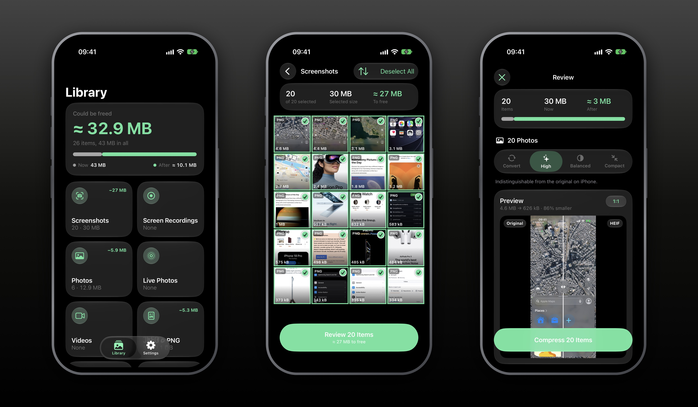

# Screenloss
Native iOS app that shrinks your photo library by converting and compressing screenshots, photos, Live Photos and videos to HEIC/HEVC. Built 100% in Swift.

## Features
- Local, no account, no ads
- Liquid Glass
- Browse by category: screenshots, screen recordings, photos, Live Photos, videos, JPEG & PNG, large files
- Four quality levels, with a before/after preview
- Keeps metadata: capture date, location, favorites, albums, screenshot tag, HDR
- Live Photos stay Live, or become still photos
- Originals go to Recently Deleted, only after iOS asks you
- Keeps running in the background
- Custom accent color, the app icon follows

## Requirements
- iOS 26+

## Install
Build it from source with Xcode.

## Known limitations
- The "date added" can't be kept: iOS sets it when the new copy is saved.
- Edits and Photographic Styles are baked into the new copy.
- RAW, Portrait, bursts, spatial and Cinematic media, slow motion and Loop/Bounce Live Photos are left alone.
